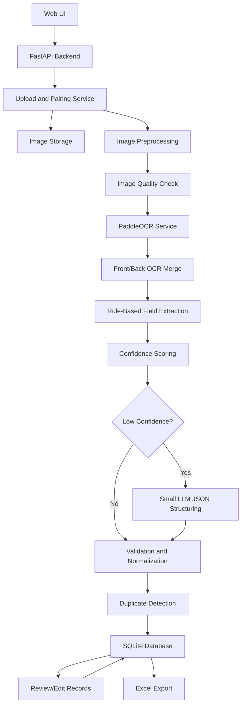

# PaddleOCR Business Card Scanner HLD

Status: Review draft  
Last updated: 2026-07-01  
Related: [[03-paddleocr-business-card-scanner-lld]], [[04-implementation-plan-review]]

## Goal

Build a web-based business card scanner that accepts front and optional back images, extracts contact information using PaddleOCR, validates and structures the data, and exports clean Excel records.

The system should prioritize OCR accuracy, support real-world business cards, and use LLM APIs only when deterministic extraction confidence is low.

## Core Requirements

1. Upload one or many business card scans.
2. Support one-sided and two-sided cards.
3. Use PaddleOCR as the primary OCR engine.
4. Preserve original images for audit and review.
5. Extract structured fields:
   - name
   - designation
   - business
   - address
   - city
   - state
   - country
   - zip code
   - website
   - category
6. Store records in a local database and export to Excel.
7. Provide a basic but good-looking UI.
8. Allow review and manual correction before final export.
9. Keep LLM API calls minimal.

## Recommended Architecture



## Component Overview

### Web UI

Responsibilities:

- Upload front image and optional back image.
- Show selected card pairs before processing.
- Display OCR/extracted results in a table.
- Highlight low-confidence fields.
- Let the user edit extracted values.
- Download Excel output.

Recommended UI shape:

- Top bar with app name and health status.
- Main scan area with front/back upload controls.
- Batch pair mode for multiple cards.
- Results table with editable rows.
- Image preview modal showing front/back.

### Backend API

Responsibilities:

- Accept uploads.
- Save original files.
- Orchestrate OCR and extraction.
- Return structured records.
- Persist records and Excel output.
- Serve saved images and downloads.

Recommended stack:

- FastAPI
- Pydantic models
- PaddleOCR
- OpenCV/Pillow for preprocessing
- SQLite for local source-of-truth storage
- openpyxl for Excel export

### PaddleOCR Service

Responsibilities:

- Run OCR on preprocessed front/back images.
- Return text lines, bounding boxes, confidence, and side metadata.
- Preserve raw OCR output for debugging.

PaddleOCR should be the default and primary OCR engine. If installation or runtime fails, the system can optionally fall back to RapidOCR or cloud OCR later, but that should be treated as a secondary path.

### Extraction Service

Responsibilities:

- Merge front/back OCR text.
- Extract easy fields using deterministic rules.
- Use spatial and line-order heuristics for name, designation, company, and address.
- Decide whether LLM fallback is needed.

### LLM Fallback Service

Responsibilities:

- Accept only OCR text, not images, whenever possible.
- Return strict JSON.
- Run only when confidence is low, required fields are missing, or front/back data conflicts.

Details: [[02-llm-minimized-extraction-design]]

### Excel Storage

Responsibilities:

- Export reviewed database records into an `.xlsx` workbook.
- Apply useful formatting:
  - low confidence rows
  - duplicate rows
  - required missing fields
- Preserve raw OCR text in optional audit columns or a separate sheet.

### Database Storage

Responsibilities:

- Store events, cards, OCR results, extracted fields, reviewed records, and export metadata.
- Make review/edit safe before Excel export.
- Support duplicate detection across an event.
- Preserve front/back side relationships.
- Keep raw OCR and LLM audit data available for accuracy tuning.

Recommended first database: SQLite.

Details: [[06-database-plan]]

## Two-Sided Card Handling

Business cards can have:

1. Front only.
2. Front plus back with address/social/contact details.
3. Back-only useful information such as QR code, branch address, product list, or alternate language.

The system should model one business card as one logical record:

```text
BusinessCard
  card_id
  front_image
  back_image optional
  front_ocr_result
  back_ocr_result optional
  merged_extraction
  final_reviewed_record
```

Phone handling:

```text
country_code: inferred from address/country when possible
phone_number: local/national number
phone_primary: normalized international number
```

The app uses address text as a fallback hint for phone country-code verification.

Merge priority:

1. If front and back both have email/phone/website, keep the higher confidence value and store alternates.
2. If one side has only address, attach it to the same card record.
3. If both sides have different companies, flag for manual review.
4. If multilingual duplicate data exists, prefer the language configured by the event or user.

## Accuracy Strategy

Accuracy should be improved before OCR, during OCR, and after OCR.

### Before OCR

- Image type support: JPG, JPEG, PNG, HEIC.
- Auto-rotate by EXIF and OCR angle classification.
- Perspective crop.
- Deskew.
- Contrast enhancement.
- Optional upscale for small text.
- Blur and low-light warnings.

### During OCR

- Use PaddleOCR angle classification.
- Preserve confidence per line.
- Preserve bounding boxes for layout heuristics.
- Use language/model configuration suitable for event audience.

### After OCR

- Regex extraction for email, phone, website.
- Phone normalization with country hints.
- Email validation.
- Website normalization.
- Address parsing heuristics.
- Confidence score per field and per card.
- LLM fallback only when needed.

## Storage Layout

```text
events/
  {event_id}/
    metadata.json
    app.db
    images/
      {card_id}_front.jpg
      {card_id}_back.jpg
    ocr/
      {card_id}.json
    exports/
      contacts.xlsx
```

## Excel Output

Recommended columns:

```text
Date
Name
Designation
Business
Address
City
State
Country
Zip Code
Website
Category
```

Category values:

```text
Engineering
Industrial Services
Certification
Supply Chain Management
Marine Contractors
Oil & Gas
Manufacturing
Construction
Logistics
Trading
Other
```

## Non-Goals For First Build

- CRM integrations.
- Full mobile native app.
- Automatic QR code contact import.
- Cloud deployment.
- Multi-user authentication.
- Hosted PostgreSQL deployment.

These can be added after the local web workflow is stable.
