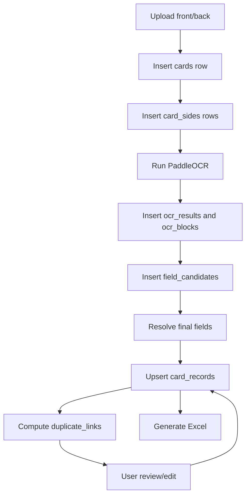

# Database Plan

Status: Review draft  
Last updated: 2026-07-01  
Related: [[01-paddleocr-business-card-scanner-hld]], [[03-paddleocr-business-card-scanner-lld]], [[04-implementation-plan-review]]

## Recommendation

Use SQLite in V1 as the source of truth.

Excel should be treated as an export, not the main storage layer.

## Why SQLite First

SQLite is the best fit for the first version because:

- No database server is required.
- It works well with FastAPI for local or single-machine usage.
- It is simple to back up with the event folder.
- It supports review/edit workflows better than Excel-only storage.
- It makes duplicate detection faster and cleaner.
- It can later migrate to PostgreSQL with minimal conceptual changes.

## Storage Model

Recommended event folder:

```text
events/
  {event_id}/
    app.db
    metadata.json
    images/
      {card_id}_front.jpg
      {card_id}_back.jpg
    ocr/
      {card_id}.json
    exports/
      contacts.xlsx
```

## Database Scope

Use one SQLite database per event:

```text
events/{event_id}/app.db
```

Benefits:

- Each exhibition/event is portable.
- A corrupt or large event does not affect other events.
- Backup is easy.
- Deleting or archiving one event is straightforward.

Future option:

- Use one central SQLite database if cross-event deduplication becomes important.
- Move to PostgreSQL if multi-user hosting is required.

## Tables

### `events`

Stores event metadata.

Columns:

```text
event_id text primary key
name text not null
date text not null
location text
booth text
notes text
created_at text not null
updated_at text not null
```

### `cards`

Stores one logical business card.

Columns:

```text
card_id text primary key
event_id text not null
status text not null
processing_mode text not null
confidence_score text
duplicate_flag text default 'No'
created_at text not null
updated_at text not null
```

Status values:

```text
uploaded
processing
processed
needs_review
reviewed
exported
error
```

### `card_sides`

Stores front/back image metadata.

Columns:

```text
side_id text primary key
card_id text not null
side text not null
filename text not null
content_type text
width integer
height integer
quality_score text
quality_warnings text
created_at text not null
```

### `ocr_results`

Stores OCR output per side.

Columns:

```text
ocr_result_id text primary key
card_id text not null
side text not null
engine text not null
engine_version text
raw_text text
average_confidence real
created_at text not null
```

### `ocr_blocks`

Stores OCR line-level details for layout-aware extraction.

Columns:

```text
block_id text primary key
ocr_result_id text not null
line_index integer not null
text text not null
confidence real
bbox_json text
```

### `field_candidates`

Stores all extracted candidates before final resolution.

Columns:

```text
candidate_id text primary key
card_id text not null
field_name text not null
value text not null
confidence real
source text not null
evidence text
created_at text not null
```

Source values:

```text
front
back
merged
rule
llm
user
```

### `card_records`

Stores the final editable business card record.

Columns:

```text
record_id text primary key
card_id text not null unique
event_id text not null
name text
designation text
company text
phone_primary text
phone_extra text
email text
website text
address text
city text
state text
country text
zip_code text
category text
confidence_score text
low_confidence_fields text
duplicate_flag text default 'No'
front_image_filename text
back_image_filename text
reviewed_by_user integer default 0
created_at text not null
updated_at text not null
```

### `duplicate_links`

Stores duplicate relationships.

Columns:

```text
duplicate_id text primary key
event_id text not null
card_id text not null
matched_card_id text not null
match_type text not null
match_score real
reason text
created_at text not null
```

Match types:

```text
email_exact
phone_exact
name_company_fuzzy
possible
```

### `exports`

Stores generated Excel export history.

Columns:

```text
export_id text primary key
event_id text not null
filename text not null
row_count integer
created_at text not null
```

## Indexes

Recommended indexes:

```text
cards(event_id)
card_records(event_id)
card_records(email)
card_records(phone_primary)
card_records(company)
duplicate_links(event_id)
ocr_results(card_id)
field_candidates(card_id)
```

## Write Flow



## Review/Edit Flow

When a user edits a row:

1. Update `card_records`.
2. Set `reviewed_by_user = 1`.
3. Set card status to `reviewed`.
4. Regenerate Excel when the user downloads or clicks export.

## Excel Export Flow

Excel should not be manually appended as the primary write path.

Instead:

1. Query reviewed and processed records from `card_records`.
2. Generate `contacts.xlsx`.
3. Add one row to `exports`.
4. Return the file to the user.

This avoids Excel corruption and makes edits reliable.

## Raw OCR Storage

Recommended:

- Store raw OCR text in `ocr_results`.
- Store line-level boxes in `ocr_blocks`.
- Also write optional JSON audit files under `ocr/` for easy human inspection in Obsidian or file explorer.

## Migration Strategy

For V1, use a simple schema initializer:

```text
if app.db does not exist:
  create all tables
  create indexes
```

Later, add migrations with:

- Alembic if using SQLAlchemy.
- Plain SQL migration files if using `sqlite3`.

## Library Choice

Recommended first choice:

```text
SQLAlchemy + SQLite
```

Reason:

- Easier future migration to PostgreSQL.
- Cleaner repository layer.
- Better testability.

Alternative:

```text
sqlite3 standard library
```

Reason:

- Fewer dependencies.
- Enough for small local usage.

Recommendation:

Use SQLAlchemy if we expect this app to grow. Use `sqlite3` only if we want the leanest possible implementation.

## Future PostgreSQL Migration

Move to PostgreSQL when:

- Multiple users need simultaneous access.
- Data needs to be centralized across devices.
- Cross-event duplicate detection becomes important.
- The app is deployed to a server.

Tables should stay mostly the same.

## Start New File Reset

The UI has a `Start New File` action for the selected event. It keeps the event and database file, but clears the current card file contents:

```text
cards
card_records
card_sides
ocr_results
ocr_blocks
field_candidates
duplicate_links
exports table rows
events/<event_id>/images/*
events/<event_id>/ocr/*
events/<event_id>/exports/*
```

It does not clear `llm_usage`, because local API usage history should remain available for quota monitoring.
